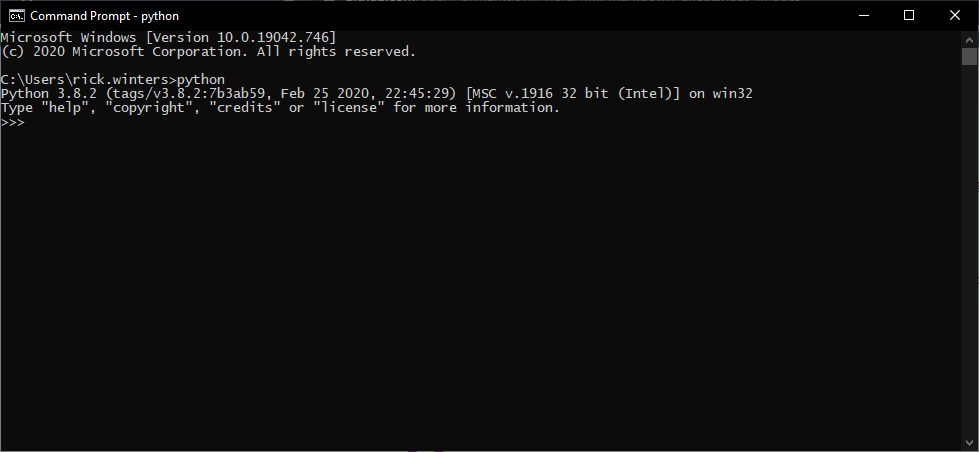
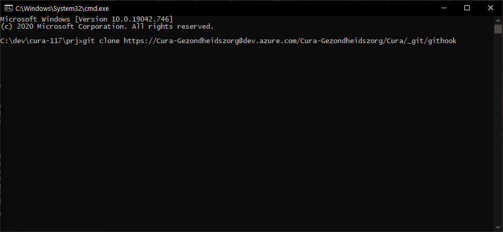
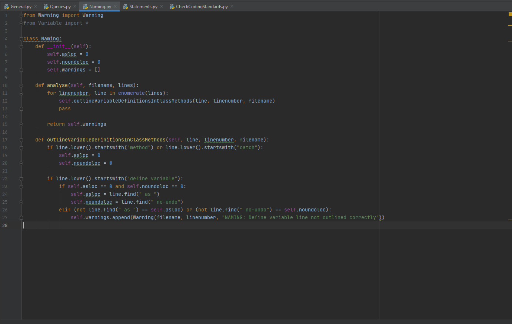

# Introduction 
This is some python scripts that will check your progress code against coding standards before committing. 
You can either call this script directly or use it an the pre-commit git hook (recommended).
This is still a work in project but some coding standards are already implemented. 
The coding standards (to be) implemented are based on https://fierit-cura.atlassian.net/wiki/spaces/RC/pages/384762016/Coding+Standards+Old+see+comment

When you use this code in pre-commit hook it will cancel the commit if any warnings are given, if the code adheres to all implemented coding standards the commit will continue


# Getting Started
1. Installation process

    1. Installation of Python
        * Download and install latest version of python (3.8.2 or later) using the following link. https://www.python.org/downloads/ 
        * Follow istallation procedures, be sure to check "add to PATH". 
        * After installation, open the command prompt and type `python`. You should see the following. 
        
        * If you dont see this, please contact me (Rick Winters).
        * If you see a version number, you can try `print("hello world")`

    2. Make sure to install the required python packages by:
        * If you are still in the python console type `quit()` to quit the python console, else:
        * Type `python -m pip install GitPython`. This will install GitPython (version 3.1.12 or later) and its dependencies automatically for the python environment.
        * Type `python -m pip install pathlib`. This will install pathlib (version 1.0.1 or later) automatically

    3. Cloning this repository
        * Go to the folder one above your cura10303 project, by default this should be C:/dev/cura-117/prj
        * Open a command window in this folder and type `git clone https://Cura-Gezondheidszorg@dev.azure.com/Cura-Gezondheidszorg/Cura/_git/githook`
        
        * Create a file `path.txt` in the same folder as CheckCodingStandards.py, and add your cura project path as a first line. Use forward slashes.
          For example:
        ```
        C:/dev/cura-117/prj/cura10303
        ```
        * That's it. There is no need to compile this code as python as in interpreted language. 
    
    4. Setting it as git-hook (Optional)
        * Navigate to `../cura10303/.git/hooks` and add a file called "pre-commit" (no .XXX or file)
        * Open the file with your favourite text editor and add the following 2 lines
        ```
            #!/bin/sh
            python. C:/dev/cura-117/prj/githook/CheckCodingStandards.py
        ```
        * Save the file. This should work as a pre-commit hook. 

2.	Software dependencies 
    * There are no know software dependencies

# Usage
There are currently multiple ways to call CheckCodingStandards.py.
How the script acts depends on keywords givin in the system arguments to set flags.  

* No arguments:
    - `python CheckCodingStandards.py`
    
    This will check all the files staged for commit in the set repo. This is also how the git pre-commit hook is calling the script. 
    Calling this script manually or through the git hook will result in the same output
    The warnings given will be by default only on changed lines of code for files that are staged for commit. 

* One keyword
    1) `Python CheckCodingStandards.py help`:
    
        Will output the help strings for multiple classes in this repo, among which are all the implemented coding standards.
    
    2) `Python CheckCodingStandars.py askInput [input / fullinput] [varargs]` (capital I):
    
        Prompts the user to input either a filename or the full path on disk, depending on if 'input' or 'fullinput' keyword used later.
    
    3) `Python CheckCodingStandards.py [filename / full path on disk] [input / fullinput] [varargs]`:
    
        This option requires requires of 'input' or 'fullinput'. If you use 'input' you can enter only the filename of the file to be checked. Using fullinput keyword requires the complete path on disk of the file
    
        - "Python CheckCodingStandards.py darostercodeandtime input" --> valid, will check file daRosterCodeAndTime
        - "Python CheckCodingStandards.py C:/dev/cura-117/prj/cura10303/unit4/cura/drv/server/dataaccess/darostercodeandtime.cls input" --> invalid
        - "Python CheckCodingStandards.py darostercodeandtime fullinput" -- invalid, fullinput requires complete path on disk
        - "Python CheckCodingStandards.py C:/dev/cura-117/prj/cura10303/unit4/cura/drv/server/dataaccess/darostercodeandtime.cls fullinput" --> valid 
    
    4) `Python CheckCodingStandards.py githook [varargs]`
    
        This option will set the flags 'askInput', 'input', 'fullinput' to False (default behaviour) but allows for the `[varargs]` to be parsed when called from the githook. 
    
* on the place of `[varargs]` you can enter the following keywords in random order and random amount:
    The 3rd and following keywords kan be passed in random order in random length, capitalsensitive. The list of recognized keywords (so far) is:
    1) sortWarnings --> output of warnings is sorted by linenumber ascending
    2) sortWarningsReversed --> output of warnings is sorted by linenumber descending
    3) fullFile --> will force to output all warnings given, otherwise only warnings on changed lines of code will be given if the file is staged for commit.
    4) githook --> only to be placed in the githook script calling. This will set 'input', 'fullinput' and 'askInput' to False.
    5) repeat --> if set, user will be prompted to re-check the files.   
    
    More keywords that change the behaviour may come in the future 

# Latest updates
    List of changes since latest Development meeting: 
    15-06-2021
    Substitute outlining now stops at closing bracket of substitute( --> fixes a bug where errors where reported within an assign block
    Fixed a bug where 'assignemnt must be on next line of assign statement' was given with variables starting with 'assign' in the variable name
    ----
    Changed outlining of queries so that ['no-lock' / 'exclusive-lock'] must be left-outlined plus 2 spaced for 'find' on queries starting with 'find'
    instead of left-outlined with 'where'.
    Left-outlining with 'where' still counts for queries starting with 'for'. 
    @HKM, thanks for the feedback
    
# Upcoming changes
    Implementing coding standards
    Fixing reported false warnings

# Build and Test
There is no need to build or compile this code as python is an interpreted language.
If you have set the pre-commit hook to execute CheckCodingStandards.py, it will always be executed on a git-commit. 
This project is not written with an git GUI tools in mind, but for use with the Git Bash. 

You can also execute this code opening the command prompt and typing "python C:\dev\cura-117\prj\githook\CheckCodingStandards.py". 


# Contribute
You can request new coding standard to be implemented by contacting me (Rick Winters), please include:
* a reference to the standard,
* a screenshot of case where it is done wrong (or multiple cases),
* the filename of the code in the screenshot,
* the warning message you'd like to see. 

If you know python and would like to implement it yourself than follow these steps, assuming you have an editing environment setup:
For the examples i use PyCharm. You can contact me if you wish to install this and set it up. 
1. Open the correct Category file, for example if we want to implement a standard in the NAMING category, open Naming.py
    
2. Define a new method with a comprehensive name that takes atleast the following parameters `self, line, linenumber, filename` as follows
``` Python
def METHODNAMEHERE(self, line, linenumber, filename):
```
3. Write your logic to find out if a standard is followed or not
4. If a certain linenumber within the code does not follow the coding standard, add a warning as follows: 
``` Python
self.warnings.append(Warning(filename, linenumber, "YOUR MESSAGE AS A STRING HERE"))
```
5. Call the method you just created in the analyse method. Look at line 12 `self.outlineVariableDefinitionsInClassmethods(line, linenumber, filename)` for example.
6. If done and tested, make a Pull Request to me (Rick Winters)